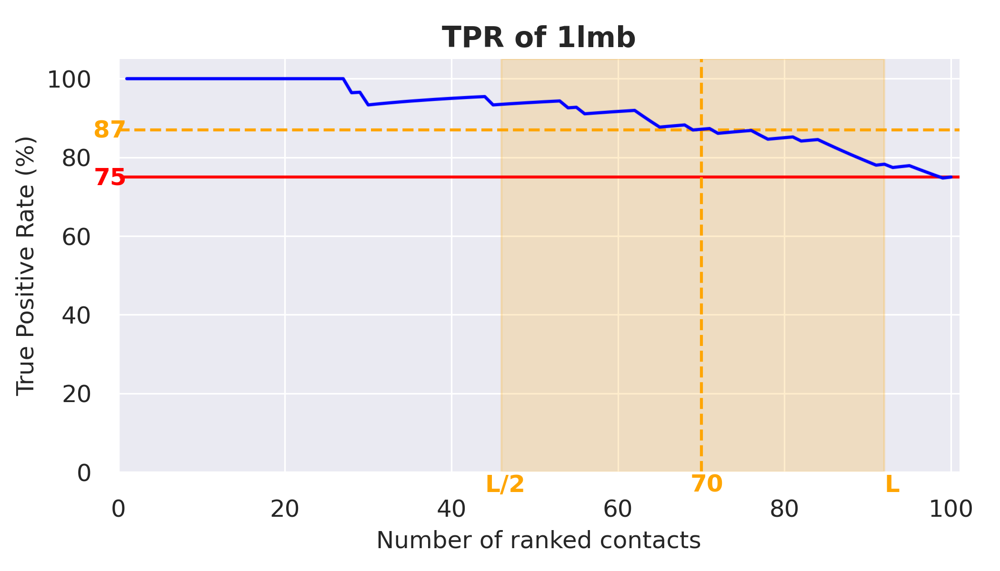

# Summary

Proteins are complex biomolecules which fulfil important and diverse tasks in
living organism. Studying and understanding their structure, function and
dynamics is essential for life sciences and can, for instance, be applied for
disease control or to improve drug design. Molecular dynamics (MD) is a
computational method which relies on phyisical models to simulate biomolecular
systems. The movements of all atoms can be "viewed" like a movie and analyzed to
improve the understanding of specific interactions or complement conducted
experiments. Replica-Exchange (REX [@sugita1999replica:1991,
@zhang2005convergence:2005]) is a powerful method used to enhance sampling of
protein conformations which generates large amounts of data. `pyREX` is designed
as an interactive "all-purpose" toolkit for research projects which rely on
(contact-guided) Replica-Exchange Molecular Dynamics using GROMACS
[@van2005gromacs:2005]. Due to its workflow-orientated design it is possible to
quickly create whole setup or analyses workflows which significantly enhances
productivity and reduces the time spend at various stages of the project.

# Statement of need

Timescales of various biomolecular interactions of interest, such as protein
folding, conformation transitions or ligand bonding, are typically in the order
of µs to s. MD simulations, however, operate in 1-2 fs steps, which makes
in-silico studies of proteins computational demanding. Besides, observations of
native state configurations during MD simulations are often not guaranteed and
proteins can get trapped in certain conformations. One possibility to overcome
this problem is to utilize one of the many enhanced sampling techiques, such as
REX. Depending on the research goal it is also possible to integrate additional
theoretically-derived [@morcos2011direct:2011] or experimentally-derived
[@perilla2017cryoem:2017] bias into MD simulations and reduce the search space
to effectively lower the computational costs.

Research studies relying on REX, however, can become very ardous and time
consuming. REX simulations usually require not only knowledge of various program
tools but also consist of many individual steps ranging from simulation setup,
pre-processing, testing, monitoring the simulations, post-processing to data
analyses. Furthermore, REX generates large amounts of data and requires a good
structure when handling I/O.

`pyREX` is designed as an interactive "all-purpose" toolkit specifically for
(contact-guided) REX projects using GROMACS and is meant to be used in
jupyter notebooks. It integrates some popular MD-related python packages, e.g.:
- MDAnalysis [@gowers2019mdanalysis:2019 ; @michaud2011mdanalysis:2011],
- nglview [@nguyen2018nglview:2018],
- GromacsWrapper [@oliver_beckstein_2019_2654393:2019].

By covering all important aspects, `pyREX` eliminates the need of switching to
additional programs which unnecesary interrupts the workflow and often requires
know-how of different command line syntaxes. Furthermore, 'pyREX' offers many
workflow-orientated functions and templates for different stages of a REX study.
Its main focuses are 1) to provide efficient and robust methods for setting up
optimized (contact-guided) REX simulations and 2) to offer many different
structure analyses functions to exploit the large I/O sets generated by REX.
It also adds a variety of useful general functions and QoL improvements, such as
interactively linked figures and trajectory or creation of multi-panel figures
from .pickle files. With `pyREX` it becomes especially easy to share and
reproduce research results or transfer the work on other target structures of
interest. Furthermore, it lowers the technical boundaries for newcomers who want
to do research using REX for enhanced sampling.

# Applications

`pyREX` was initially developed during the work of [@voronin2020including,
2020]. It is currently applied on two ongoing REX studies about protein and RNA
structure refinement. Fig. 1 exemplarily shows the invesigation of the true
positive rate for used bias contacts. Fig. 2 shows the local accuracy based on a
global distance test for models generated during a REX study.

![Analysis of the true positive rate (TPR) for bias contacts using 'pyREX'. The
figure shows many important factors when analysing the TPR and an estimated
ideal number of contacts based on selection rules from [@voronin2020including,
2020]](paper_figs/fig1.png)

# Acknowledgements

We want to thank all developers and contributors of MDAnalysis, which is the
backbone of pyREX as it allows us to parse and analyze MD-related data files.

This work is supported by the Helmholtz Association Initiative and Networking
Fund under project number ZT-I-0003.

# References
